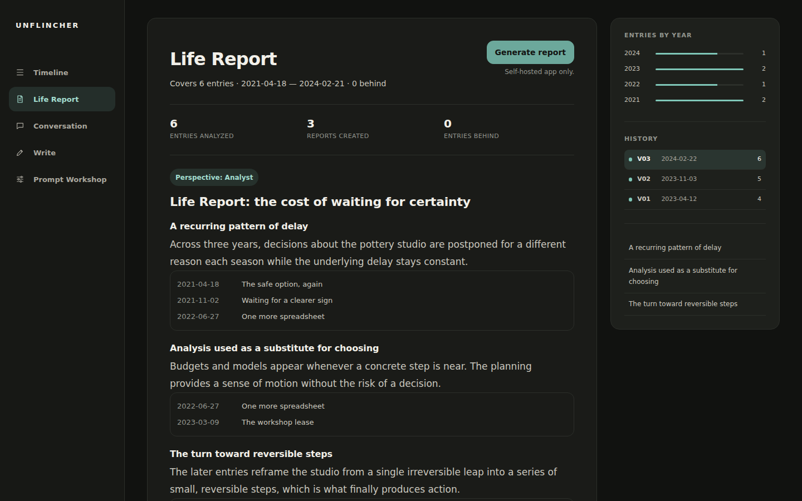

# Unflincher

Unflincher is an evidence-grounded AI reflection partner for people with years of journal entries.
It reads across your Journal Archive, finds recurring patterns, points each interpretation back to
dated entries, and lets you challenge the reading in Conversation.

Source available for noncommercial use.



- Explore the fictional demo: https://sinmentis.github.io/unflincher/demo/
- Install Unflincher: [docs/deployment.md](docs/deployment.md)

## What this is

A normal journal shows one day at a time. Unflincher looks across the archive for changes,
contradictions, recurring explanations, and goals that are hard to see entry by entry.

- Single-user and self-hosted, with no account system or multi-tenancy.
- FastAPI, Jinja2, htmx, Server-Sent Events, and local SQLite storage, with no frontend build step.
- GitHub Copilot as the only model integration, reusing your existing Copilot access.
- Entry References that name the dated entries behind an interpretation. They are not independently
  verified citations.
- Nine translated interface catalogs. Entries, instructions, and generated text stay in the
  language in which they were written.

## Perspectives

Unflincher uses one globally active Perspective for future Entry Reflections, Life Reports, and
Conversations. Changing it never rewrites existing generated content.

- **Companion** acknowledges the emotional reality first, then broadens the reading without hiding a
  clear pattern.
- **Coach** connects supported patterns to decisions, goals, and small next steps.
- **Challenger** names contradiction, avoidance, and moving excuses without attacking identity or
  worth.
- **Analyst** separates observation from interpretation with minimal editorializing.
- **Custom** keeps instructions you write yourself when they do not exactly match a shipped preset.

Analyst is the default on a new database. Prompt Workshop is where you choose a Perspective, edit its
instructions, select a model, preview one entry, and apply the result.

## Product tour

- **Timeline and entry reading:** browse the Journal Archive by year and open any entry.
- **Entry Reflection:** generate a reading of one entry grounded in that entry and the archive.
- **Life Report:** create a cross-year synthesis that names the entries behind each pattern.
- **Entry and general Conversation:** challenge or extend a reading around one entry or the archive.
- **Prompt Workshop:** choose a Perspective, tune the active instructions, preview one entry, and
  keep prior prompt versions.
- **Version history:** keep every prior Entry Reflection and Life Report instead of overwriting it.

## Bring an existing archive

The supported archive import is an untouched Douban diary Excel export from the Tofu Chrome
extension. A CLI importer reads that `.xlsx` file directly. There is no browser upload or generic
spreadsheet importer.

If you have no Douban archive, skip import. Entries added from the Write page become part of the same
Journal Archive. See [docs/import.md](docs/import.md).

## Privacy and data flow

Your entries, active prompt, generated reflections, reports, and Conversation history are stored in
your local SQLite database.

GitHub Copilot is the only model integration. Each feature sends the following content to the
selected model:

- **Entry Reflection:** Entry Reflection sends the target entry, entries earlier in canonical
  chronology, and the active prompt. It never sends later entries.
- **Life Report:** Life Report sends the full Journal Archive and the active prompt.
- **General Conversation:** General Conversation sends the full Journal Archive, the active prompt,
  the complete current-session history, and the current message.
- **Entry Conversation:** Entry Conversation sends the selected entry, its latest reflection when
  present, the complete thread history, the active prompt, and the current message.
- **Prompt Workshop preview:** Prompt Workshop preview sends the target entry, entries earlier in
  canonical chronology, the draft instructions, and the selected model without persisting the
  output. It never sends later entries.
- **Conversation title:** When its separate model passes preflight, the first message of a new
  general Conversation is also sent once to generate a short title. Otherwise the date title
  remains.

The complete request must fit the selected model's context window. Unflincher fails clearly and
never silently drops older entries or Conversation history. It does not truncate, sample, summarize,
or omit older archive content to make a request fit.

The public demo contains only fictional data and performs no model calls, tracking, cookies, storage,
or writable operations. Its controls are inert where the self-hosted app would write or generate.
The demo and landing page are hosted on GitHub Pages and are subject to GitHub's platform logging and
privacy practices.

## Product boundary

Unflincher is not therapy, does not diagnose or treat, and does not impersonate a licensed
professional. It does not replace professional care or relationships with other people.

## Requirements and fast local trial

- Python 3.12 or newer.
- A GitHub Copilot subscription for generation.
- Optional Cloudflare account for the Access login gate on an internet-reachable deployment.

```bash
python3 -m venv .venv && .venv/bin/pip install -e ".[dev]"
UNFLINCHER_REQUIRE_ACCESS_AUTH=false .venv/bin/uvicorn unflincher.app:app --reload
.venv/bin/pytest -q
```

Open http://localhost:8000. Browsing, writing, and reading work immediately. Generating Entry
Reflections, Life Reports, or Conversations additionally requires `COPILOT_GITHUB_TOKEN`.

## Documentation

- Installation and deployment behind Cloudflare Access: [docs/deployment.md](docs/deployment.md)
- Safe v0.1 to v0.2 upgrade: [docs/upgrade-v0.2.md](docs/upgrade-v0.2.md)
- Backups and recovery: [docs/backup-and-recovery.md](docs/backup-and-recovery.md)
- Configuration reference: [docs/configuration.md](docs/configuration.md)
- Importing existing entries: [docs/import.md](docs/import.md)

## Contributing, security, and support

- Contributing: [CONTRIBUTING.md](CONTRIBUTING.md)
- Security policy: [SECURITY.md](SECURITY.md)
- Source code: https://github.com/sinmentis/unflincher
- Support and issues: https://github.com/sinmentis/unflincher/issues
- Changelog: [CHANGELOG.md](CHANGELOG.md)
- v0.2.0 release notes: [docs/release-notes-v0.2.0.md](docs/release-notes-v0.2.0.md)
- v0.1.0 release notes: [docs/release-notes-v0.1.0.md](docs/release-notes-v0.1.0.md)
- Questions and licensing: [GitHub Discussions](https://github.com/sinmentis/unflincher/discussions)

## License

[PolyForm Noncommercial License 1.0.0](LICENSE). Source available for noncommercial use. You can
run, fork, and modify it for personal, hobby, educational, charitable, or government use. Commercial
use requires a separate license. For licensing questions, open a discussion on the repository.
